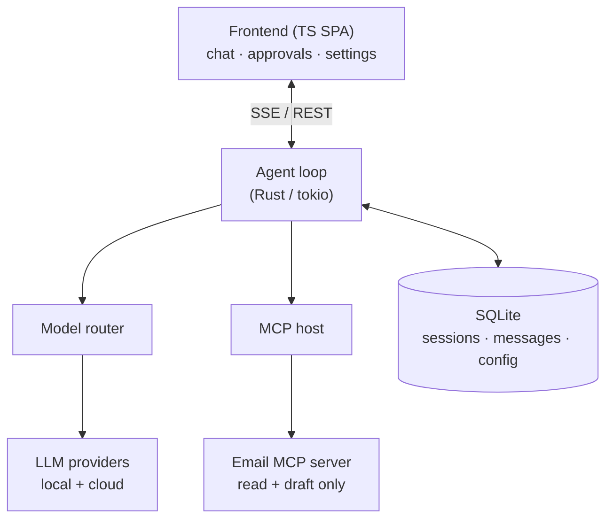

# Episteme — Architecture

> A self-hosted, local-first AI workspace.

## Overview

Episteme is a self-hosted AI workspace: a ChatGPT/Claude-style experience that
runs on your own hardware, with your own data. It speaks to **local models**
(via Ollama, vLLM, or llama.cpp) and **cloud models** (Claude, GPT, and others)
through a single interface, and it can *act* — using tools to complete tasks on
your behalf rather than only answering questions.

The guiding values are **local-first** and **privacy-first**: your conversations,
documents, and credentials live on your machine. The only data that leaves it is
the requests you explicitly route to a cloud provider you have configured.

The v1 release delivers three things: a chat interface over local and cloud
models, an agentic tool-using loop, and an email assistant that triages your
inbox and drafts replies. Everything beyond that is deliberately deferred (see
[Future Work](#future-work)).

## Goals and non-goals

### Goals

- **One interface over every model.** Local and cloud models are interchangeable
  from the user's point of view; switching is choosing a name from a list.
- **Agentic by design.** The assistant can call tools to gather information and
  perform actions, looping until a task is done.
- **Extensible without touching the core.** New capabilities are added as MCP
  servers, not as features welded into the application.
- **Owned and private.** All user data is local, in a single directory, in open
  formats. No account, no telemetry, no cloud dependency for core function.
- **Safe by default.** Irreversible actions require explicit human approval.

### Non-goals (for v1)

- **Not multi-tenant.** Episteme is single-user. There is an auth layer, but no
  team features, roles, or org management.
- **Not a model server.** Episteme *orchestrates* inference; it does not host or
  train models. Serving weights is the job of Ollama / vLLM / llama.cpp.
- **Not an enterprise knowledge platform.** No permission-aware connectors that
  continuously sync and index corporate data sources.
- **Deferred features.** Memory/RAG, calendar, notes/tasks, deep research, and
  side-by-side model comparison are out of scope for v1.

## Design principles

**1. One universal model interface.** Every model — local or remote — is reached
through a single client abstraction. The core contains no provider-specific
branching; adding a model is adding a `{name, endpoint, key, model_id}` entry to
configuration. This is the single most important decision in the system: it keeps
the provider question out of every other component.

**2. MCP is the only extension mechanism.** The core is intentionally small —
chat, an agent loop, and an MCP host. Email, calendar, browsing, file access, and
every future capability attach as [Model Context Protocol](https://modelcontextprotocol.io)
servers. The trimmed v1 is not a large system with features disabled; it is a
small core with only the servers we choose to connect. This is also how we avoid
scope creep: a feature that isn't an MCP server doesn't belong in the core.

**3. Human-in-the-loop for irreversible actions.** Tools are classified as
auto-run (read-only) or approval-required (anything that mutates external state).
The agent *proposes* mutating actions; the user confirms before they execute.
"Send email" is never autonomous in v1.

**4. Local-first and self-contained.** A single `data/` directory holds
everything: database, settings, uploads. SQLite is the only datastore required
for core operation. The app runs fully offline against local models.

**5. Admin-console security posture.** Episteme can run shell commands, read
files, and hold API tokens. It is treated as a privileged admin tool, not a
public web app — auth on by default, dangerous capabilities gated, never exposed
to a network without TLS in front.

**6. Configuration over code.** Providers and MCP servers are data, defined in a
settings store, not compiled in. Adding a model or a tool is a configuration
change, never a recompile.

## System architecture



The system is a thin TypeScript frontend talking over SSE and REST to a Rust
backend. Within the backend, the **agent loop** is the heart; it orchestrates two
subsystems — the **model router** (which reaches LLM providers) and the **MCP
host** (which reaches tool servers) — and persists state to **SQLite**. In v1 the
only tool server connected is the email server.

A single request flows like this: the user's message arrives at the agent loop,
which assembles the conversation history plus the catalog of available tools and
sends it to a model through the router. The model's reply streams back to the
frontend. If the reply contains tool calls rather than a final answer, the loop
executes them through the MCP host (pausing for approval where required), appends
the results, and goes around again — terminating when the model returns plain
text.

## Components

### Frontend (TypeScript SPA)

A single-page application. It is deliberately thin: the backend owns all logic,
the frontend renders and collects input. Four surfaces:

- **Chat** — streaming conversation view.
- **Sessions** — list and resume past conversations.
- **Settings** — manage model providers and MCP servers (both are just config).
- **Approvals** — a first-class screen showing pending tool actions awaiting the
  user's confirmation. This is not an afterthought; the human-in-the-loop
  principle makes it a primary view.

Transport is Server-Sent Events for token streaming and plain REST for everything
else. The frontend is built with **Vue 3 and TypeScript** (Vite for tooling,
Pinia for session and approval state, the native `EventSource` API for SSE
streaming). Because the backend owns all logic, the framework is not
load-bearing — the contract with the backend is what matters.

### Backend — HTTP / SSE layer

Built on `axum`. Responsibilities: serve the API, stream model output over SSE,
and hold shared state. Routes cover chat (streaming), session CRUD, provider and
MCP-server configuration, and the tool-approval endpoints. Shared services — the
model client, live MCP connections, and the database pool — live in an
`Arc<AppState>` accessed through axum's `State` extractor.

### Backend — Agent loop

The core engine, hand-written on `tokio`. In pseudocode:

```
loop {
    tools    = mcp_host.list_tools()          // discovered from connected servers
    response = model_router.stream(history, tools)
    stream_to_frontend(response)

    if response.has_tool_calls() {
        for call in response.tool_calls {
            if call.requires_approval() {
                persist_pending(call)          // pause; resume on user confirm
                return AwaitingApproval
            }
            result = mcp_host.execute(call)
            history.push(result)
        }
        continue                               // loop again with tool results
    }

    return Done                                // model returned a final answer
}
```

The one place judgment is injected is between "the model requested a tool" and
"the tool runs." Read-only tools execute immediately; mutating tools are
persisted as pending actions and surfaced to the user for approval. This is also
why the loop is hand-written rather than delegated to an off-the-shelf agent SDK:
owning the step gives us full control over the approval gate.

### Backend — Model router

The universal model interface. It exposes one streaming `complete` operation and
hides the provider behind it. Configuration is a list of providers, each a
`{name, base_url or provider, api_key, model_id}` record.

The recommended implementation is the `genai` crate, which presents one unified
API across OpenAI, Anthropic, Gemini, Ollama, and others, using each provider's
*native* protocol where available — so Claude's extended thinking and similar
provider-specific features survive rather than being flattened by an
OpenAI-compatibility shim. A simpler alternative is `async-openai` with a custom
base URL, which treats every provider (including local servers) as an
OpenAI-compatible endpoint; choose this if native-protocol features aren't
needed.

### Backend — MCP host

An MCP client built on the official `rmcp` SDK. It launches MCP servers as
subprocesses over stdio (via `TokioChildProcess`) or connects to them over HTTP,
discovers the tools each server offers, and converts their JSON Schema tool
definitions into the function-calling format the model expects. Tool calls
requested by the model are dispatched here and the structured results returned to
the agent loop.

Because `rmcp` is tokio-native, the entire request path — axum handler, model
call, and tool execution — runs on one async runtime with no bridging.

### Storage

SQLite, accessed via `sqlx` (async, compile-time-checked queries). Core tables:

- `sessions` — conversation metadata.
- `messages` — the full message history per session, including tool calls and
  results.
- `settings` — provider and MCP-server configuration.
- `pending_actions` — mutating tool calls awaiting approval, enabling a paused
  turn to resume on a later request.

Everything lives under a single gitignored `data/` directory.

## Key flows

### Agent turn

1. User sends a message; it is persisted and appended to the session history.
2. The agent loop gathers available tools from connected MCP servers.
3. History + tools are sent to the selected model; the response streams to the
   frontend token by token.
4. If the model returns a final answer, the turn ends.
5. If the model requests tools: read-only calls execute immediately; mutating
   calls are persisted as pending and an approval event is sent to the frontend,
   ending the turn.
6. On approval, the action executes and the loop resumes from the tool result.

### Email triage (draft-only)

Email is provided by an MCP server restricted to **read and draft** tools — it
has no send capability in v1. The agent can search and read the inbox, summarize
and tag messages, flag urgency, and compose reply drafts that land in the
Drafts folder for the user to review and send manually.

This restriction is a security boundary, not a convenience choice. Incoming email
is **untrusted input**: a message may contain text crafted to hijack the agent's
instructions (prompt injection). Keeping the agent's powers minimal while it
processes the inbox contains the blast radius of such an attack. Approval-gated
sending is a candidate for a later release, but draft-only is the correct v1
posture.

## Data and privacy

All user data is stored locally in `data/`. Cloud-provider API keys are held in
the settings store (or `.env` for pre-seeded deployment). No data is transmitted
anywhere except to the specific cloud model provider the user has configured and
chosen to route a request to. Running entirely against local models means no data
leaves the machine at all.

## Security

- **Auth on by default.** Never expose Episteme to a network without it.
- **TLS required for non-local access.** The app serves plain HTTP; terminate TLS
  at a reverse proxy (Caddy, nginx, Traefik) for anything beyond localhost,
  including a shared VPN address.
- **Privileged tools are gated.** Shell access, file read/write, MCP-server
  management, and token administration are treated as admin-only.
- **Mutations require approval.** No tool that changes external state runs
  without explicit user confirmation.
- **Email is untrusted.** The agent operates on the inbox with read+draft tools
  only; see [Email triage](#email-triage-draft-only).
- **Secrets hygiene.** API keys live outside version control; rotate any key ever
  exposed in a shared log, screenshot, or chat.

## Technology stack

| Layer / component   | Choice                          | Rationale |
|---------------------|----------------------------------|-----------|
| Backend language    | Rust                             | Memory safety, single static binary, strong async story; matches the team's existing expertise. |
| Async runtime       | `tokio`                          | One runtime underneath every component; `rmcp` and `axum` are both native to it. |
| HTTP / SSE server   | `axum`                           | tokio-native, built-in SSE, ergonomic shared state. |
| MCP host            | `rmcp` (official Rust SDK)       | First-party, tokio-native; `TokioChildProcess` transport spawns servers over stdio. |
| Model router        | `genai` (or `async-openai`)      | `genai` unifies many providers using native protocols; `async-openai` is the simpler OpenAI-compatible-only alternative. |
| Database            | `sqlite` via `sqlx`             | Local-first, single file, async, compile-time-checked queries. |
| Serialization       | `serde` / `serde_json`           | Tool schema and message (de)serialization. |
| Frontend            | Vue 3 + TypeScript (Vite)        | Thin client; the team's strongest framework. State via Pinia, SSE via native `EventSource`. |
| Local inference     | Ollama / vLLM / llama.cpp        | External; reached through the model router as OpenAI-compatible endpoints. |

## Build phases

1. **Core skeleton.** Backend, model router, and a streaming chat endpoint. Prove
   plain chat works against one local model and one cloud model — validating the
   universal model interface — with no agent or tools yet.
2. **Frontend chat.** Streaming chat UI with sessions persisted to SQLite.
3. **Agent loop + MCP host.** Wire in `rmcp` and the loop; validate the tool-call
   cycle end to end against a trivial test MCP server.
4. **Email integration.** Connect the email MCP server restricted to read+draft;
   build the triage and draft flow.
5. **Approvals.** Add the approval UI and the pending-action persistence that
   pauses and resumes a turn.

## Future work

Deferred beyond v1, in rough priority order:

- **Memory / RAG** — a vector store and embeddings layer for search over personal
  documents and long-term memory.
- **Approval-gated send** — graduate email from draft-only to confirmed sending.
- **Resumable streaming** — a tokio channel + long-lived task so an
  approval-paused turn resumes seamlessly instead of on a follow-up request.
- **Additional integrations** — calendar (CalDAV), notes and reminders, web
  search, file/document tools — each as an MCP server.
- **Deep research and model comparison** — multi-step research runs and
  side-by-side blind model evaluation.

## Open questions

- **Router abstraction depth.** Does `genai` cover enough providers and features
  long-term, or will a thin in-house trait over `async-openai` give more control?
- **Approval UX granularity.** Per-action approval is safe but can be noisy.
  Should trusted tools or sessions allow batched or pre-authorized approval?
- **MCP server lifecycle.** Spawn servers on demand per request, or keep them
  warm for the session? Trade-off between latency and resource use.
- **Conversation state size.** As histories grow with tool results, when and how
  to summarize or truncate context before it overflows the model window.
